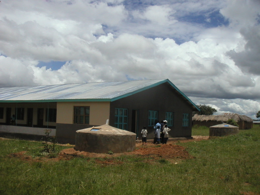
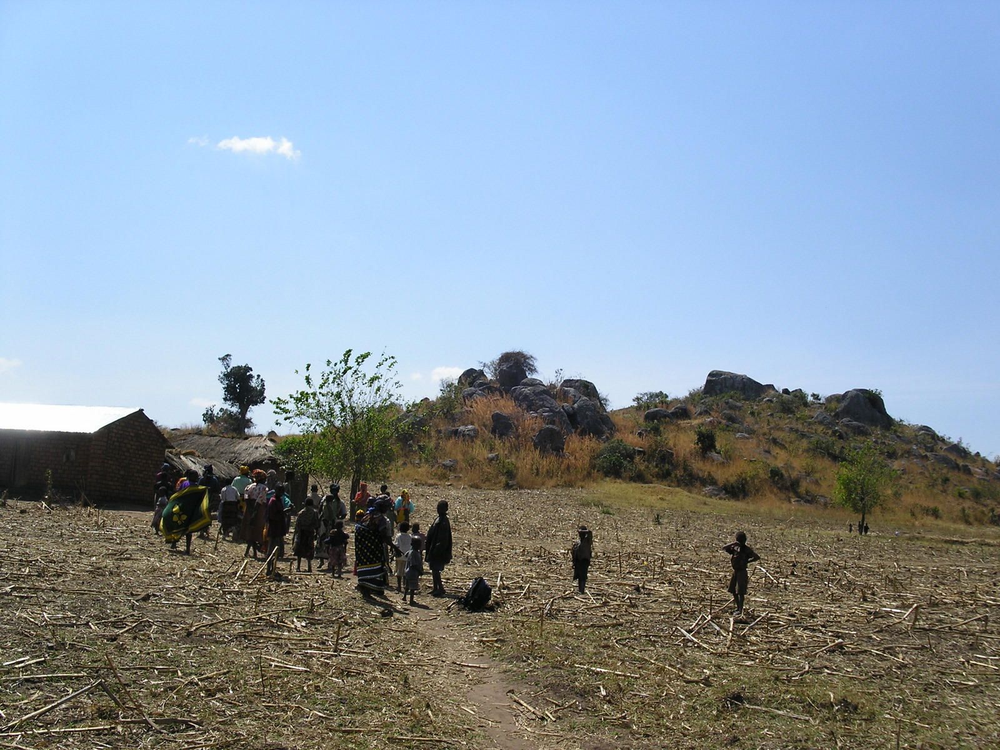
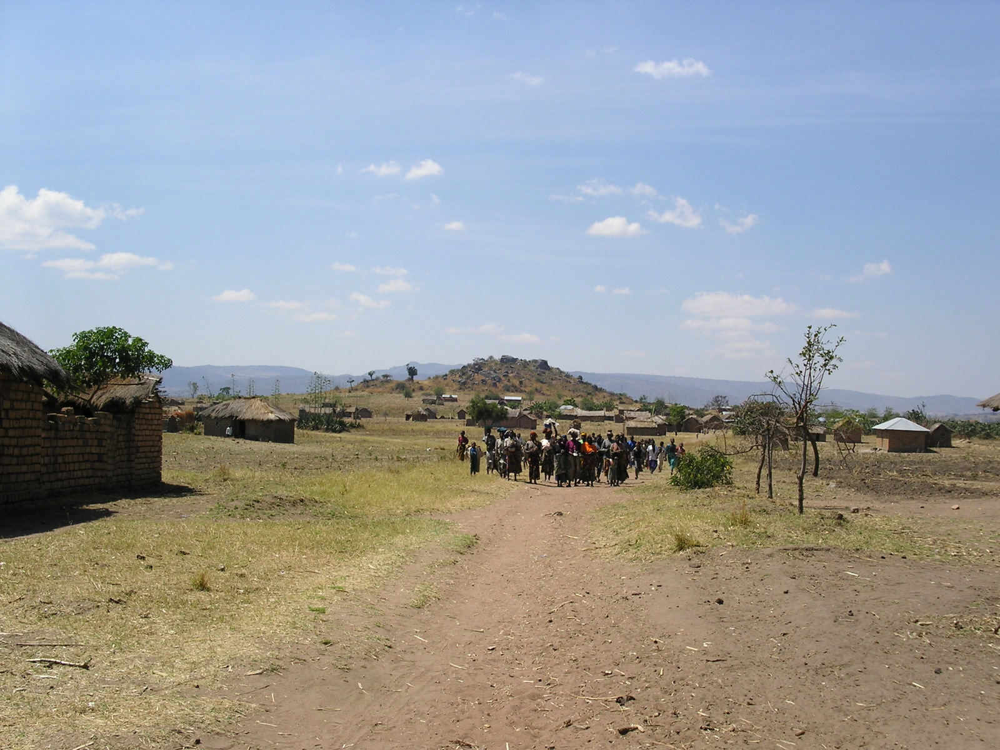
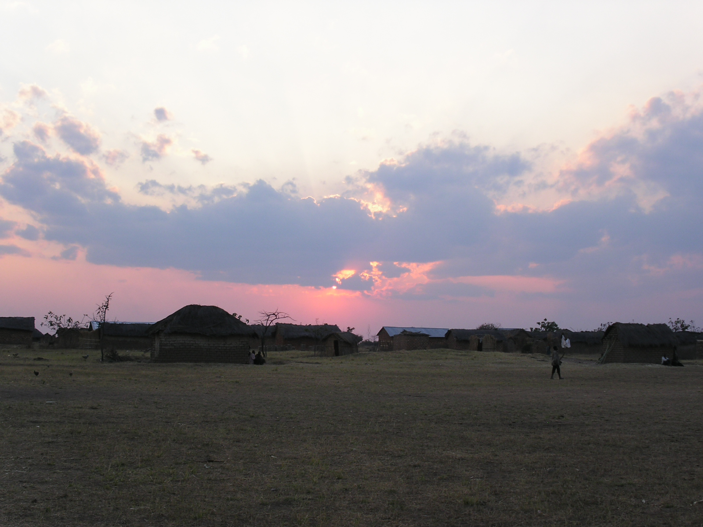
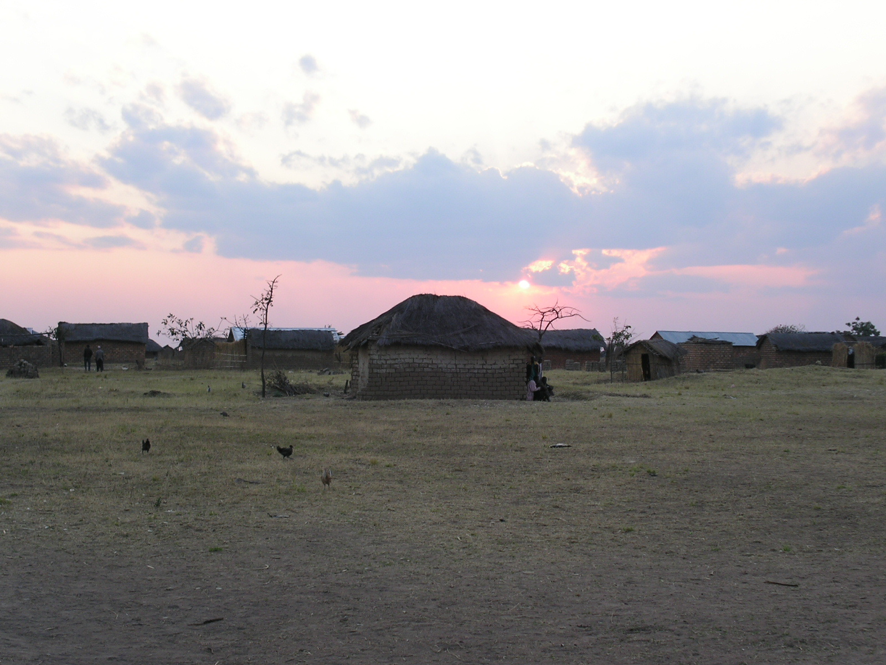

Mbeka remembers Kalalasi village as a green place full of wild fruit trees, flowers, grass, bushes and shady places. There were ponds full of frogs and other small creatures; a small river used to flow nearby. People could gather mushrooms and green vegetables. The woods nearby were great for hunting with dogs and playing hide and seek. It was near enough for children to go unsupervised.





All this changed when the local district council introduced a policy which said that people should grow maize in the village, around their homes. They believed that they would pick sweet corn as they needed it and save time walking a couple of miles to their fields. They campaigned and penalised people who didn’t do this. As a result the villagers cleared all the trees and bushes in the village. Although there were short-term benefits, as they could pick sweet corn by their dwellings, in the long term it led to serious desertification, increased incidence of malaria in the rainy season and respiratory diseases in the dry season due to huge amounts of dust. Worst of these are bronchitis, coughs and eye infections.

Once the villagers finished cutting all the trees in the nearby area, they went on to cut more and more trees to start new farms as well as for fuel purposes. The village looked ugly and bare. It also experienced strong winds which were dangerous for their houses. While we were there some of the roofs blew off. It’s not proven whether this trend led to the severe droughts they are now experiencing but as the environmental degradation covered a large area it is a possibility. The villagers realised they needed to do something about this so they instigated forest reserves. In Kalalasi they have one reserved area, the main type of tree is Miombo. Several other villages are doing the same thing. As these local trees take a long time to grow this will take a few decades to make a difference.

Since 2004 when people from SUDA visited the village we saw the need to work with the villagers to try to ameliorate the situation. With funds from SUDA, the primary school head teacher has taken a very active role. Supported by some enthusiastic villagers, together they have established a Tree Nursery. At the beginning of December 2008 about 15,000 saplings will be distributed to families to plant around their houses, the Health Centre, School and Churches. The village council has come up with a policy: if someone loses a tree they will be penalised, either by paying a fine or making bricks. This is to ensure that people look after the trees, watering them and protecting them from goats and other animals.

They are planting specific local fast growing trees for shade, fruit and firewood.

If we get enough resources we will expand this greening project to other villages.